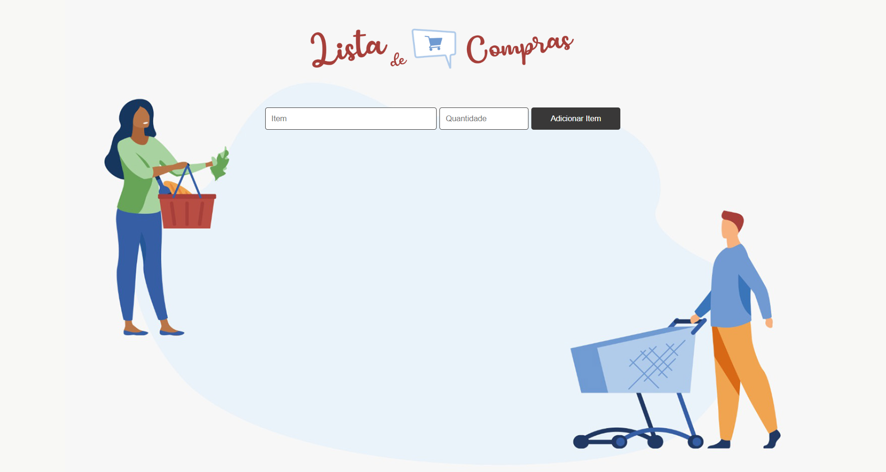

# Lista de compras

> Criação de uma lista de compras, onde fosse permitido:
>
> - incluir os itens e as quantidades;
> - Marcar os itens comprados e
> - Apagar os itens da lista.

 
Este projeto faz parte do segundo desafio, proposto pelos mentores do programa Desenvolve do Grupo Boticário.

 

> Linguagens utilizadas:
>
> - HTML
> - CSS
> - Java Script

- Link para a página: https://veronicaparanhos.github.io/lista_de_compras/
